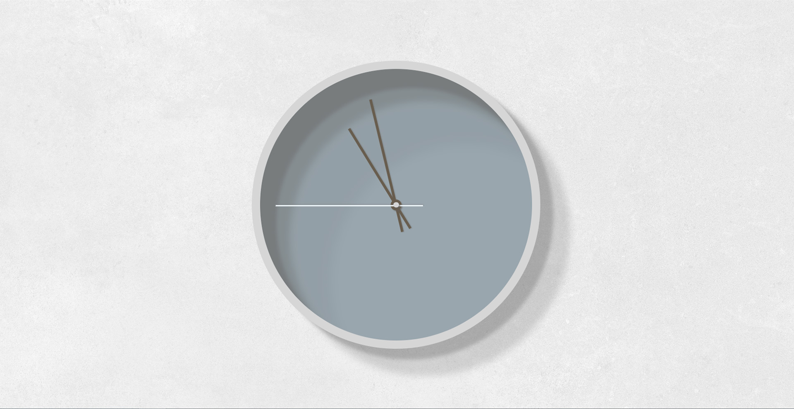

# JavaScript exercise 4 - Clock
> My fourth practical project while learning JavaScript. [Click here to preview](https://karbudzik.github.io/JavaScript-exercise-4-clock/)  
> Script based on the JavaScript30 challenge, with new visual layout.

## Screenshots

## Technologies
* HTML5.2
* plain CSS / no frameworks
* plain JavaScript / no frameworks

## Credits
* [JavaScript30 challenge](https://javascript30.com) - the script was based on the materials provided for the JavaScript30 challenge
